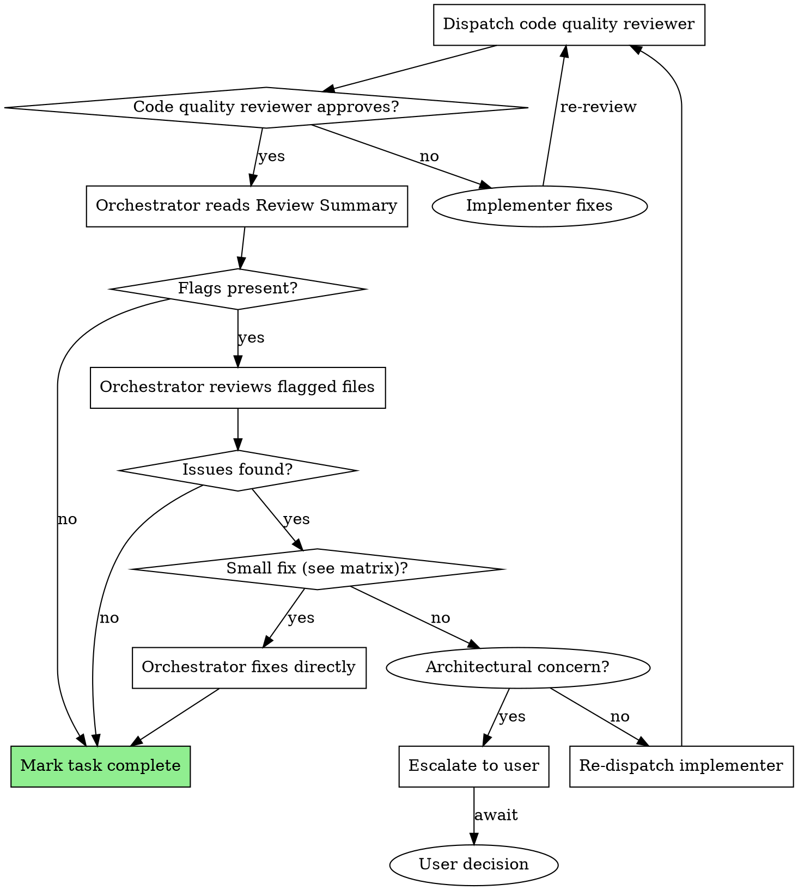

# Orchestrator Final Review - Design Document

**Date:** 2026-03-20
**Author:** Design session
**Status:** Draft

## Problem Statement

The subagent-driven-development workflow dispatches specialized subagents for implementation, spec compliance review, and code quality review. However, these subagents lack visibility into the broader project context — they see only the task at hand.

The orchestrator (the main agent running the skill) has full context: the complete plan, decisions made in previous tasks, and the project's architectural direction. This context is currently underutilized.

We want to add a final orchestrator review after code quality review, before marking each task complete, to leverage this global perspective.

## Goal

Add an orchestrator review step that:
1. Catches inconsistencies between tasks
2. Detects side effects on completed work
3. Validates readiness for upcoming tasks
4. Ensures alignment with business context
5. Keeps orchestrator context growth bounded

## Design

### High-Level Flow

```
Implementer → Spec Reviewer → Code Quality Reviewer → ORCHESTRATOR → Task complete
```

### Orchestrator Review Process

After code quality reviewer approves, the orchestrator:

1. **Read the Review Summary** — Structured output from code-quality-reviewer
2. **Check flags** — If flags are present, open those specific files
3. **Cross-reference mentally** — Previous tasks, upcoming tasks, global context
4. **Act if needed** — Fix directly, re-dispatch implementer, or escalate

### Review Summary Format

The code-quality-reviewer must produce this structured output at the end of their review:

```markdown
## Review Summary

**Files changed:** [`path/to/file1.ts`, `path/to/file2.ts`]

**What was implemented:** [2-3 sentences describing the main implementation]

**Dependencies affected:** [list of imports/exports that changed, or "none"]

**Flags for orchestrator:** [list of flags requiring orchestrator attention, or "none"]
- Examples: "Modified shared utility", "Changed internal API signature", "Touched hot path", "New dependency added"
- A module is considered "shared" if imported by 2+ other files

**Verdict:** ✅ Approved / ❌ Needs fixes
```

### Edge Case: Missing or Malformed Review Summary

If the code quality reviewer doesn't produce a Review Summary or produces a malformed one:

1. **Re-dispatch reviewer** with a reminder: "Your review is missing the required Review Summary section. Please add it in the format specified."
2. **If re-dispatch also fails**, the orchestrator falls back to reading `git diff HEAD~1` directly and proceeds with the review

This ensures the workflow doesn't stall on reviewer non-compliance while maintaining quality.

### Context Control Strategy

To prevent context explosion:

- Orchestrator reads only the Review Summary (short, structured)
- Opens specific files only when flags are present
- Cross-reference is mental — orchestrator already has plan context and previous task history
- No full code review — that's the code-quality-reviewer's job

### Orchestrator Action Matrix

| Problem type | Action |
|--------------|--------|
| Typos, unused imports, local variable names | Fix directly |
| Rename private functions/methods, adjust error messages | Fix directly |
| Small logic adjustments in isolated functions | Fix directly |
| Add small helper functions | Fix directly |
| Adjust internal (non-public) function signatures | Fix directly |
| Refactor code within a single function | Fix directly |
| Changes to public APIs or shared modules | Re-dispatch implementer |
| Logic changes affecting multiple files | Re-dispatch implementer |
| Architectural concerns | Escalate to user |

## Implementation

### Files to Modify

1. **`skills/subagent-driven-development/SKILL.md`**
   - Add "Orchestrator Review" section with process and action matrix
   - Update DOT diagram with new flow
   - Update example workflow to show orchestrator review

2. **`skills/requesting-code-review/code-reviewer.md`**
   - Add required Review Summary output format at the end of the review template

### No New Files Required

All changes fit into existing files.

## Updated Flow Diagram



## Example Workflow (Updated)

```
Task 1: Hook installation script

[Implementer completes]
[Spec reviewer approves]
[Code quality reviewer produces:]
  ## Review Summary
  **Files changed:** [`src/hooks/install.ts`, `src/hooks/index.ts`]
  **What was implemented:** Added install-hook command with --force flag support. Registers hook in config file.
  **Dependencies affected:** Exported `installHook` from index.ts
  **Flags for orchestrator:** "Modified shared config module"
  **Verdict:** ✅ Approved

[Orchestrator review:]
  - Reads summary
  - Flag present: opens src/config/index.ts
  - Checks: config module change is additive, no breaking changes
  - Cross-reference: next task needs config read, this prepares well
  - No issues found

[Mark Task 1 complete]

Task 2: Recovery modes

[Implementer completes]
[Spec reviewer approves]
[Code quality reviewer produces:]
  ## Review Summary
  **Files changed:** [`src/hooks/recover.ts`]
  **What was implemented:** Added verify and repair modes with progress reporting every 100 items.
  **Dependencies affected:** none
  **Flags for orchestrator:** none
  **Verdict:** ✅ Approved

[Orchestrator review:]
  - Reads summary
  - No flags
  - Cross-reference: naming "recover" vs Task 1's "install" — consistent pattern
  - No issues found

[Mark Task 2 complete]

...

Task 4: API client

[Implementer completes]
[Spec reviewer approves]
[Code quality reviewer produces:]
  ## Review Summary
  **Files changed:** [`src/api/client.ts`, `src/api/types.ts`]
  **What was implemented:** HTTP client with retry logic and typed responses.
  **Dependencies affected:** Exported ApiClient from client.ts
  **Flags for orchestrator:** "Changed shared error handling"
  **Verdict:** ✅ Approved

[Orchestrator review:]
  - Reads summary
  - Flag present: opens src/utils/errors.ts
  - Checks: error handling change removes `retryCount` field that Task 2's recover.ts uses
  - Issue found: breaking change to shared module
  - Action: re-dispatch implementer with feedback to preserve `retryCount` field
```

## Trade-offs

### Why this approach

- **Leverages existing context** — Orchestrator already has the big picture
- **Bounded context growth** — Only opens specific files when flagged
- **Clear boundaries** — Action matrix prevents scope creep
- **Minimal changes** — Fits into existing files and workflow

### Alternatives considered

1. **Create orchestrator-review-prompt.md** — Rejected: orchestrator is not a subagent
2. **Orchestrator reviews full diff** — Rejected: would explode context
3. **Orchestrator only does sanity checks** — Rejected: too shallow, misses consistency issues

## Success Criteria

- Orchestrator review catches consistency issues when they exist (not forcing false positives)
- Zero regressions to completed tasks discovered in later tasks
- No significant context growth for orchestrator (measured by token usage)
- Workflow remains fast — orchestrator review adds <30 seconds per task
- Clear action boundaries — no ambiguity about when to fix vs re-dispatch
