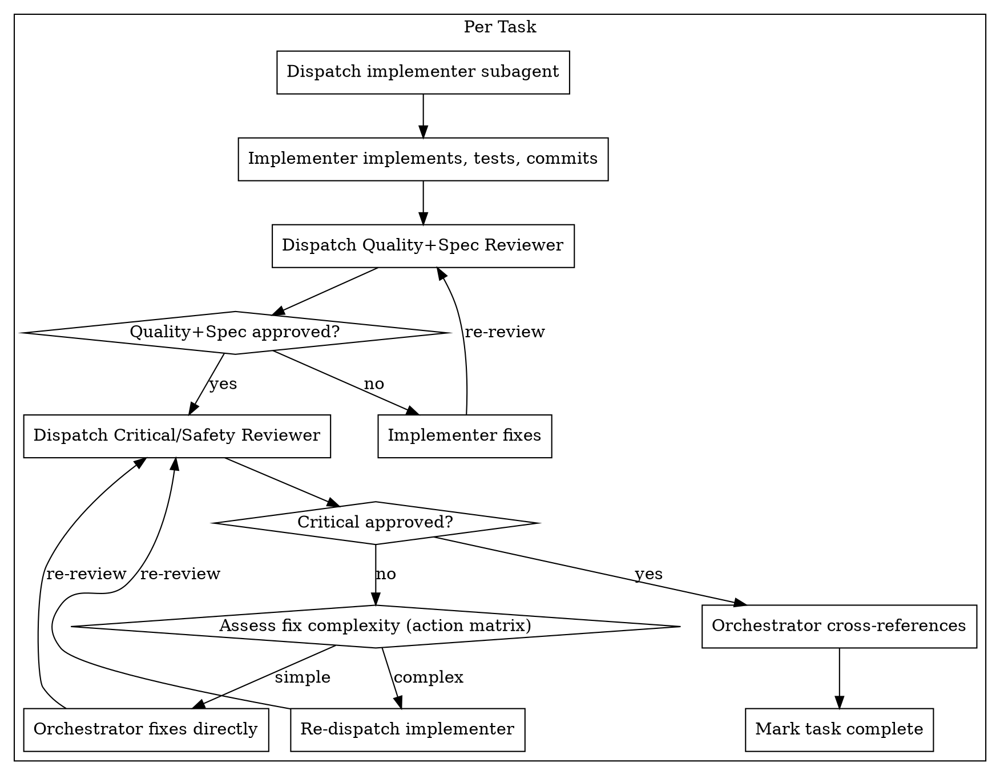

# Design: Sistema de Review em Dois Estágios

**Data:** 2026-03-23
**Status:** Draft
**Skill afetada:** `subagent-driven-development`

## Contexto

O fluxo atual de review no subagent-driven-development possui dois reviewers em sequência:

1. **Spec Reviewer:** "Implementou o que foi pedido?"
2. **Code Quality Reviewer:** "O código está bem escrito?"

**Problemas identificados:**
- Spec review é superficial e pouco efetiva
- Não há revisão focada em efeitos colaterais e pontos cegos
- Implementers focam na task específica e podem ignorar impacto em outras partes do sistema
- Lixo de implementação (console.log, TODO, mock data) passa despercebido

## Solução

Substituir o fluxo de dois reviewers por um novo sistema de dois estágios com responsabilidades diferentes:

| Antes | Depois |
|-------|--------|
| Spec Reviewer | Fundido no Quality+Spec Reviewer |
| Code Quality Reviewer | Quality+Spec Reviewer (spec + quality unificados) |
| — | Critical/Safety Reviewer (novo) |

## Fluxo

```
Implementer implementa → Quality+Spec Reviewer → Critical/Safety Reviewer → Orchestrator review → Task complete
                              ↓ falhar                  ↓ falhar
                         Implementer corrige      Implementer corrige (ou orchestrator se simples)
```

### Diagrama



## Componentes

### 1. Quality+Spec Reviewer

**Responsabilidade:** Verificar que o implementer fez o que foi pedido E que o código está bem escrito.

**O que revisa:**

1. **Spec Compliance:**
   - Implementou tudo que foi pedido?
   - Implementou algo extra não solicitado?
   - Interpretação correta dos requisitos?

2. **Code Quality:**
   - Separação de responsabilidades
   - Error handling
   - Testes (que testam lógica de verdade)
   - Edge cases

**O que NÃO revisa:**
- Efeitos colaterais em arquivos não editados (responsabilidade do Critical Reviewer)
- Riscos técnicos profundos (responsabilidade do Critical Reviewer)
- Segurança (responsabilidade do Critical Reviewer)

**Integração com requesting-code-review skill:**
- O novo prompt é auto-contido e não referencia o `code-reviewer.md` da skill `requesting-code-review`
- Conceitos de code quality são inlined no novo prompt para simplicidade
- A skill `requesting-code-review` continua existindo para uso ad-hoc fora do subagent-driven-development

**Output format:**

```
### Strengths
[O que está bem feito]

### Issues
#### Critical
[Bugs, funcionalidade quebrada]
#### Important  
[Features faltando, arquitetura problemática]
#### Minor
[Estilo, otimizações]

### Assessment
Ready? [Yes/No/With fixes]

## Review Summary
**Changed files:** [...]
**What was implemented:** [...]
**Spec compliance:** ✅ Full / ⚠️ Partial / ❌ Failed
**Spec issues:** [lista ou "none"]
**Dependencies affected:** none (Critical Reviewer responsibility)
**Flags for orchestrator:** [...]
**Verdict:** ✅ Approved / ❌ Needs fixes
```

### 2. Critical/Safety Reviewer

**Responsabilidade:** Identificar pontos cegos que o implementer e o Quality+Spec reviewer podem ter perdido.

**Foco principal (alta prioridade):**

1. **Efeitos colaterais em dependências:**
   - Lista arquivos que NÃO foram editados mas dependem de funções alteradas
   - Usa code-indexer se disponível, ou git grep / leitura manual
   - Pergunta: "A mudança em X afeta Y que importa X?"

2. **Riscos técnicos + segurança:**
   - Race conditions, memory leaks, resource exhaustion
   - SQL injection, XSS, auth bypass, secrets in code
   - Específico da linguagem/framework do projeto

**Foco secundário (menor prioridade):**

3. **Lixo de implementação:**
   - console.log, var_dump, dd(), debug prints
   - TODO/FIXME não endereçados
   - Mock data, código comentado
   - Imports não utilizados

**code-indexer fallback:**
- Usa code-indexer se disponível para identificar dependências automaticamente
- Se code-indexer não estiver disponível, usa git grep + leitura manual
- Quando code-indexer não está disponível, o reviewer deve indicar "Reduced confidence" no Review Summary e o orchestrador deve considerar review manual adicional para mudanças em APIs públicas

**Loop limit:**
- O mesmo limite de "2 tentativas" do SKILL.md atual se aplica ao Critical Reviewer loop
- Após 2 falhas consecutivas no Critical Review: problema menor → log e continue; problema bloqueante → escalar para usuário

**Output format:**

```
### Side Effects Analysis
**Affected dependents (files NOT changed but impacted):**
- `path/to/FileA.ts` — imports `checkout()` which was modified
- `path/to/FileB.ts` — extends `PaymentService` which has new required param

**Risk:** [High/Medium/Low] — [explique por quê]

### Technical + Security Risks
**Risks found:**
- [lista de riscos com file:line e severidade]
- OU "None identified"

### Implementation Debris
**Debris found:**
- [console.log, TODO, mock data, etc com file:line]
- OU "None found"

### Assessment
**Safe to merge?** [Yes/No/With fixes]

## Review Summary
**Changed files:** [...]
**Affected dependents:** [lista de arquivos não editados que dependem das mudanças, ou "none identified"]
**Side effect risk:** [High/Medium/Low/None]
**Security risks:** [lista ou "none"]
**Debris:** [lista ou "none"]
**Flags for orchestrator:** [problemas que precisam atenção]
**Verdict:** ✅ Approved / ❌ Needs fixes / ⚠️ Approved with notes
```

### 3. Orchestrator

**Action matrix para problemas do Critical Reviewer:**

| Problema | Ação |
|----------|------|
| Lixo de implementação (console.log, etc) | Orchestrator remove diretamente |
| Import não utilizado | Orchestrator remove diretamente |
| Risco de segurança simples | Orchestrator corrige se óbvio, senão re-dispatch |
| Side effect em dependência | Re-dispatch implementer com contexto |
| Risco técnico complexo | Re-dispatch implementer com contexto |
| Problema arquitetural | Escalar para usuário |

## Mudanças em Arquivos

### Novos arquivos

1. **`skills/subagent-driven-development/quality-spec-reviewer-prompt.md`**
   - Prompt unificado para Quality+Spec Reviewer
   - Combina spec compliance + code quality
   - Template de output com campo Spec compliance

2. **`skills/subagent-driven-development/critical-reviewer-prompt.md`**
   - Prompt para Critical/Safety Reviewer
   - Foco em side effects, riscos técnicos, segurança, lixo
   - Template de output com campo "Files NOT changed but affected"

### Arquivos removidos

1. **`skills/subagent-driven-development/spec-reviewer-prompt.md`**
2. **`skills/subagent-driven-development/code-quality-reviewer-prompt.md`**

**Nota de migração:** Os novos prompts são escritos do zero, incorporando o melhor dos prompts antigos mas sem cópia direta. Os prompts antigos servem como referência durante a implementação mas não como fonte de código.

### Arquivos modificados

1. **`skills/subagent-driven-development/SKILL.md`**
   - Atualizar diagrama do fluxo
   - Atualizar seção "The Process"
   - Atualizar seção "Prompt Templates"
   - Adicionar novos Red Flags:
     - Pular Critical Review depois que Quality+Spec passar
     - Ignorar "Files NOT changed but affected" do Critical Review
     - Aceitar lixo de implementação sem questionar
     - Ignorar riscos de segurança identificados

## Red Flags Adicionados

**Never:**
- Pular Critical Review depois que Quality+Spec passar
- Ignorar "Files NOT changed but affected" do Critical Review
- Aceitar lixo de implementação (console.log, var_dump, etc) sem questionar
- Ignorar riscos de segurança identificados pelo Critical Reviewer
- Mover para próxima task enquanto Critical Review tem issues abertos

## Critérios de Sucesso

1. Quality+Spec Reviewer detecta desvios de spec e problemas de qualidade
2. Critical Reviewer identifica side effects em dependências não editadas
3. Critical Reviewer detecta riscos técnicos e de segurança
4. Lixo de implementação é caught antes de merge
5. Orchestrator usa action matrix corretamente para decidir quem corrige

## Validação

Após implementação, validar o sistema rodando em 3 implementações passadas com issues conhecidas:

1. **Caso 1 (spec deviation):** Implementação que adicionou feature não solicitada
   - Esperado: Quality+Spec Reviewer detecta "extra work"
   
2. **Caso 2 (side effect):** Mudança em função compartilhada que quebrou outro componente
   - Esperado: Critical Reviewer identifica o arquivo afetado em "Affected dependents"
   
3. **Caso 3 (debris):** Implementação com console.log e TODO deixados
   - Esperado: Critical Reviewer detecta em "Debris"

Se todos os 3 casos passarem, o sistema está validado.
