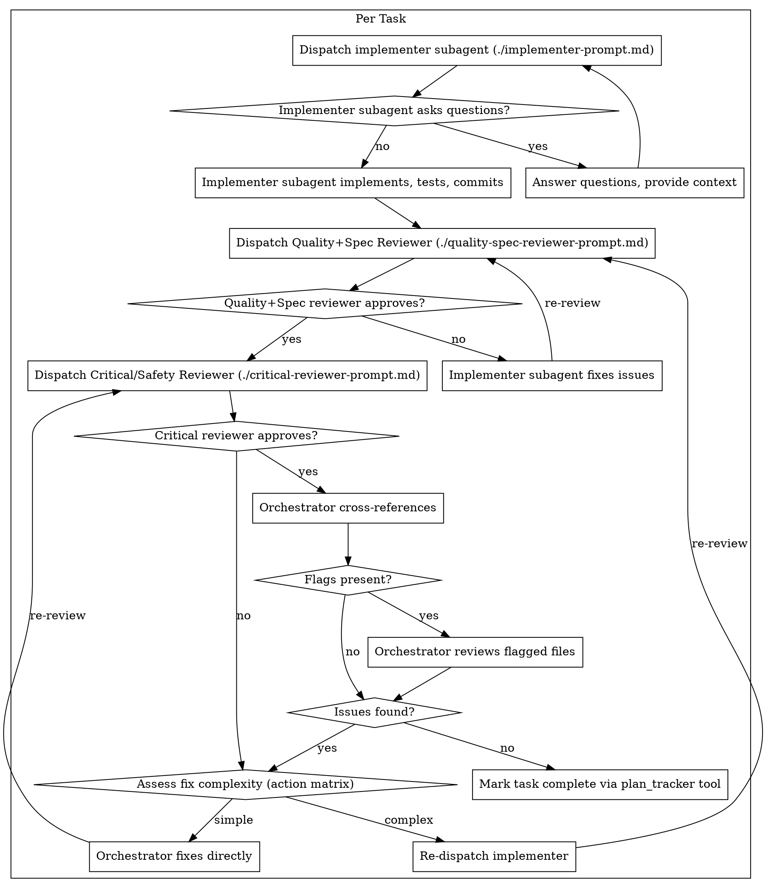

# Two-Stage Review System Implementation Plan

> **For agentic workers:** REQUIRED: Use `/skill:subagent-driven-development` (preferred in-session) or `/skill:executing-plans` (parallel session) to implement this plan. Steps use checkbox syntax for tracking.

**Goal:** Replace the current two-reviewer system (spec → quality) with a new two-stage system (quality+spec → critical/safety)

**Architecture:** Two new reviewer prompts with distinct responsibilities - Quality+Spec Reviewer handles spec compliance and code quality in one pass, Critical/Safety Reviewer focuses on side effects, security risks, and implementation debris. SKILL.md is updated to reflect the new flow.

**Tech Stack:** Markdown prompts, Graphviz diagrams

**Design Doc:** `docs/plans/2026-03-23-two-stage-review-system-design.md`

---

## File Structure

| File | Action | Purpose |
|------|--------|---------|
| `skills/subagent-driven-development/quality-spec-reviewer-prompt.md` | Create | Unified spec + quality review prompt |
| `skills/subagent-driven-development/critical-reviewer-prompt.md` | Create | Side effects, security, debris review prompt |
| `skills/subagent-driven-development/spec-reviewer-prompt.md` | Delete | Replaced by quality-spec-reviewer |
| `skills/subagent-driven-development/code-quality-reviewer-prompt.md` | Delete | Replaced by quality-spec-reviewer |
| `skills/subagent-driven-development/SKILL.md` | Modify | Update flow, diagram, references, red flags |

---

## Task 1: Create Quality+Spec Reviewer Prompt

**TDD scenario:** Not applicable - documentation task

**Files:**
- Create: `skills/subagent-driven-development/quality-spec-reviewer-prompt.md`

- [ ] **Step 1: Write the Quality+Spec Reviewer prompt template**

Create a new file with the unified reviewer prompt:

```markdown
# Quality+Spec Reviewer Prompt Template

Use this template when dispatching a quality+spec reviewer subagent.

**Purpose:** Verify implementer built what was requested AND that the code is well-written.

**Only dispatch after implementer completes and commits.**

## Boundaries

- **Read code, run tests, run git commands: yes**
- **Edit, create, or delete any source files: NO**
- You are a reviewer. Your output is a written report. You never touch the code.

---

Dispatch a subagent with this prompt:

```
You are reviewing code changes for spec compliance AND code quality.

## Boundaries

- **Read code, run tests, run git commands: yes**
- **Edit, create, or delete any source files: NO**
- You are a reviewer. Your output is a written report. You never touch the code.

## What Was Requested

[FULL TEXT of task requirements]

## What Implementer Claims They Built

[From implementer's report]

## Git Range to Review

**Base:** {BASE_SHA}
**Head:** {HEAD_SHA}

```bash
git diff --stat {BASE_SHA}..{HEAD_SHA}
git diff {BASE_SHA}..{HEAD_SHA}
```

## CRITICAL: Do Not Trust the Report

The implementer's report may be incomplete, inaccurate, or optimistic. You MUST verify everything independently by reading the actual code.

## Your Job

### Part 1: Spec Compliance

**Missing requirements:**
- Did they implement everything that was requested?
- Are there requirements they skipped or missed?
- Did they claim something works but didn't actually implement it?

**Extra/unneeded work:**
- Did they build things that weren't requested?
- Did they over-engineer or add unnecessary features?

**Misunderstandings:**
- Did they interpret requirements differently than intended?
- Did they solve the wrong problem?

### Part 2: Code Quality

**Code quality checks:**
- Clean separation of concerns?
- Proper error handling?
- Type safety (if applicable)?
- DRY principle followed?
- Edge cases handled?

**Testing:**
- Tests actually test logic (not mocks)?
- Edge cases covered?
- All tests passing?

## Output Format

### Strengths
[What's well done? Be specific with file:line references.]

### Issues

#### Critical (Must Fix)
[Bugs, broken functionality, missing core requirements]

#### Important (Should Fix)
[Architecture problems, missing features, poor error handling, test gaps]

#### Minor (Nice to Have)
[Code style, optimization opportunities, documentation improvements]

**For each issue:**
- File:line reference
- What's wrong
- Why it matters
- How to fix (if not obvious)

### Assessment

**Ready to proceed to Critical Review?** [Yes/No/With fixes]

**Reasoning:** [Technical assessment in 1-2 sentences]

## Review Summary

**REQUIRED:** End every review with this structured summary.

```markdown
## Review Summary

**Changed files:** [`path/to/file1.ts`, `path/to/file2.ts`]

**What was implemented:** [2-3 sentences describing the main implementation]

**Spec compliance:** ✅ Full / ⚠️ Partial / ❌ Failed

**Spec issues:** [list specific issues or "none"]

**Dependencies affected:** none (Critical Reviewer responsibility)

**Flags for orchestrator:** [list of flags requiring orchestrator attention, or "none"]

**Verdict:** ✅ Approved / ❌ Needs fixes
```

## Critical Rules

**DO:**
- Verify spec compliance by reading code, not trusting report
- Categorize issues by actual severity
- Be specific (file:line, not vague)
- Explain WHY issues matter
- Acknowledge strengths
- Give clear verdict

**DON'T:**
- Say "looks good" without checking
- Mark nitpicks as Critical
- Give feedback on code you didn't review
- Be vague ("improve error handling")
- Avoid giving a clear verdict
```

---

**How to dispatch:**

```ts
subagent({ agent: "quality-spec-reviewer", task: "... filled template ..." })
```

**Placeholders:**
- `[FULL TEXT of task requirements]` - The complete task spec
- `[From implementer's report]` - What the implementer claims to have built
- `{BASE_SHA}` - Commit before task started
- `{HEAD_SHA}` - Current commit
```

- [ ] **Step 2: Verify file was created**

Run: `ls -la skills/subagent-driven-development/quality-spec-reviewer-prompt.md`
Expected: File exists with content

- [ ] **Step 3: Commit**

```bash
git add skills/subagent-driven-development/quality-spec-reviewer-prompt.md
git commit -m "feat(review): add quality+spec reviewer prompt template"
```

---

## Task 2: Create Critical/Safety Reviewer Prompt

**TDD scenario:** Not applicable - documentation task

**Files:**
- Create: `skills/subagent-driven-development/critical-reviewer-prompt.md`

- [ ] **Step 1: Write the Critical/Safety Reviewer prompt template**

Create a new file with the critical reviewer prompt:

```markdown
# Critical/Safety Reviewer Prompt Template

Use this template when dispatching a critical/safety reviewer subagent.

**Purpose:** Identify side effects, security risks, and implementation debris that the implementer and quality-spec reviewer may have missed.

**Only dispatch after Quality+Spec Reviewer approves.**

## Boundaries

- **Read code, run git commands, use code-indexer: yes**
- **Edit, create, or delete any source files: NO**
- You are a reviewer. Your output is a written report. You never touch the code.

---

Dispatch a subagent with this prompt:

```
You are a critical/safety reviewer. Your job is to find what others missed: side effects, security risks, and implementation debris.

## Boundaries

- **Read code, run git commands, use code-indexer if available: yes**
- **Edit, create, or delete any source files: NO**
- You are a reviewer. Your output is a written report. You never touch the code.

## What Was Changed

[From implementer's report and git diff]

## Git Range to Review

**Base:** {BASE_SHA}
**Head:** {HEAD_SHA}

```bash
git diff --stat {BASE_SHA}..{HEAD_SHA}
git diff {BASE_SHA}..{HEAD_SHA}
```

## Your Job

### Priority 1: Side Effects in Dependencies (HIGH)

**Critical question:** "What files were NOT changed but might be affected by these changes?"

**Steps:**
1. Identify functions/classes/exports that were modified
2. Find files that import or depend on those symbols
3. Assess whether the change could break them

**Use available tools:**
- If `code-indexer` is available: use it to find references
- Otherwise: use `git grep` or read imports manually

**Ask:**
- Did a function signature change? Who calls it?
- Was a shared module modified? What depends on it?
- Was an API contract changed? Are consumers aware?

### Priority 2: Technical + Security Risks (HIGH)

**Security checks:**
- SQL injection, XSS, auth bypass
- Secrets/credentials in code
- Insecure dependencies
- Missing input validation

**Technical risks:**
- Race conditions
- Memory leaks
- Resource exhaustion
- Deadlocks
- Data corruption potential

**Language-specific concerns:**
- [Adjust based on project language]

### Priority 3: Implementation Debris (LOWER)

**Look for:**
- `console.log`, `var_dump`, `dd()`, `print()`, debug statements
- `TODO`, `FIXME`, `HACK` comments not addressed
- Mock data, hardcoded test values
- Commented-out code
- Unused imports
- Dead code

## Output Format

### Side Effects Analysis

**Affected dependents (files NOT changed but impacted):**
- `path/to/FileA.ts` — imports `checkout()` which was modified; [specific impact]
- `path/to/FileB.ts` — extends `PaymentService` which has new required param; [specific impact]

**Risk level:** [High/Medium/Low/None]

**Reasoning:** [Why this risk level?]

### Technical + Security Risks

**Risks found:**
- [risk type] at `file:line` — [description and severity]
- OU "None identified"

### Implementation Debris

**Debris found:**
- `console.log` at `file:line`
- `TODO` at `file:line`: [content]
- OU "None found"

### Assessment

**Safe to merge?** [Yes/No/With fixes]

**Reasoning:** [Assessment in 1-2 sentences]

## Review Summary

**REQUIRED:** End every review with this structured summary.

```markdown
## Review Summary

**Changed files:** [`path/to/file1.ts`]

**Affected dependents:** [list files not changed that depend on modified code, or "none identified"]

**Confidence:** ✅ Full (code-indexer used) / ⚠️ Reduced (manual analysis only)

**Side effect risk:** [High/Medium/Low/None]

**Security risks:** [list or "none"]

**Debris:** [list or "none"]

**Flags for orchestrator:** [problems requiring orchestrator attention, or "none"]

**Verdict:** ✅ Approved / ❌ Needs fixes / ⚠️ Approved with notes
```

## Critical Rules

**DO:**
- List affected dependents explicitly — this is your most important output
- Use code-indexer if available for reliable dependency tracking
- If code-indexer unavailable, note "Reduced confidence" in summary
- Focus on what the implementer couldn't see (files outside their scope)
- Be specific about security risks
- Give clear verdict

**DON'T:**
- Only review the changed files — you MUST look at dependents
- Skip the affected dependents analysis
- Ignore security concerns
- Accept debug statements without flagging
- Be vague about side effects
```

---

**How to dispatch:**

```ts
subagent({ agent: "critical-reviewer", task: "... filled template ..." })
```

**Placeholders:**
- `[From implementer's report and git diff]` - Summary of what changed
- `{BASE_SHA}` - Commit before task started
- `{HEAD_SHA}` - Current commit
- `[Adjust based on project language]` - Language-specific security/technical concerns
```

- [ ] **Step 2: Verify file was created**

Run: `ls -la skills/subagent-driven-development/critical-reviewer-prompt.md`
Expected: File exists with content

- [ ] **Step 3: Commit**

```bash
git add skills/subagent-driven-development/critical-reviewer-prompt.md
git commit -m "feat(review): add critical/safety reviewer prompt template"
```

---

## Task 3: Update SKILL.md - Diagram

**TDD scenario:** Not applicable - documentation task

**Files:**
- Modify: `skills/subagent-driven-development/SKILL.md`

- [ ] **Step 1: Update the diagram in "The Process" section**

Replace the existing diagram with the new two-stage review flow:



- [ ] **Step 2: Commit**

```bash
git add skills/subagent-driven-development/SKILL.md
git commit -m "docs(skill): update diagram for two-stage review system"
```

---

## Task 4: Update SKILL.md - Description and Process Text

**TDD scenario:** Not applicable - documentation task

**Files:**
- Modify: `skills/subagent-driven-development/SKILL.md`

- [ ] **Step 1: Update the skill description header**

Change:
```markdown
Execute plan by dispatching fresh subagent per task, with two-stage review after each: spec compliance review first, then code quality review.

**Core principle:** Fresh subagent per task + two-stage review (spec then quality) = high quality, fast iteration
```

To:
```markdown
Execute plan by dispatching fresh subagent per task, with two-stage review after each: Quality+Spec review first, then Critical/Safety review.

**Core principle:** Fresh subagent per task + two-stage review (quality+spec → critical) = high quality, catches blind spots
```

- [ ] **Step 2: Update "vs. Executing Plans" section**

Change:
```markdown
- Two-stage review after each task: spec compliance first, then code quality
```

To:
```markdown
- Two-stage review after each task: Quality+Spec first, then Critical/Safety
```

- [ ] **Step 3: Commit**

```bash
git add skills/subagent-driven-development/SKILL.md
git commit -m "docs(skill): update description for two-stage review system"
```

---

## Task 5: Update SKILL.md - Prompt Templates Section

**TDD scenario:** Not applicable - documentation task

**Files:**
- Modify: `skills/subagent-driven-development/SKILL.md`

- [ ] **Step 1: Update "Prompt Templates" section**

Change:
```markdown
## Prompt Templates

- `./implementer-prompt.md` - Dispatch implementer subagent
- `./spec-reviewer-prompt.md` - Dispatch spec compliance reviewer subagent
- `./code-quality-reviewer-prompt.md` - Dispatch code quality reviewer subagent

**How to dispatch:**

Use the `subagent` tool directly with the template text filled in:

```ts
subagent({ agent: "implementer", task: "... full implementer prompt text ..." })
```

```ts
subagent({ agent: "spec-reviewer", task: "... full review prompt text ..." })
```

```ts
subagent({ agent: "code-reviewer", task: "... full review prompt text ..." })
```
```

To:
```markdown
## Prompt Templates

- `./implementer-prompt.md` - Dispatch implementer subagent
- `./quality-spec-reviewer-prompt.md` - Dispatch Quality+Spec reviewer subagent
- `./critical-reviewer-prompt.md` - Dispatch Critical/Safety reviewer subagent

**How to dispatch:**

Use the `subagent` tool directly with the template text filled in:

```ts
subagent({ agent: "implementer", task: "... full implementer prompt text ..." })
```

```ts
subagent({ agent: "quality-spec-reviewer", task: "... full quality+spec review prompt text ..." })
```

```ts
subagent({ agent: "critical-reviewer", task: "... full critical/safety review prompt text ..." })
```
```

- [ ] **Step 2: Commit**

```bash
git add skills/subagent-driven-development/SKILL.md
git commit -m "docs(skill): update prompt templates section for two-stage review"
```

---

## Task 6: Update SKILL.md - Orchestrator Review Section

**TDD scenario:** Not applicable - documentation task

**Files:**
- Modify: `skills/subagent-driven-development/SKILL.md`

- [ ] **Step 1: Update "Orchestrator Review" section header and intro**

Change:
```markdown
### Orchestrator Review

After code quality reviewer approves, the orchestrator **always** performs a final review before marking the task complete.

**What the orchestrator reviews:**
1. Read the Review Summary from code-quality-reviewer
```

To:
```markdown
### Orchestrator Review

After Critical/Safety reviewer approves, the orchestrator **always** performs a final review before marking the task complete.

**What the orchestrator reviews:**
1. Read the Review Summary from critical-reviewer
```

- [ ] **Step 2: Add new action matrix for Critical Reviewer problems**

Add a new subsection after "How the orchestrator acts" titled "Action matrix for Critical Reviewer problems":

```markdown
### Action Matrix for Critical Reviewer Problems

When the Critical/Safety reviewer finds issues, use this matrix to decide who fixes:

| Problem type | Action |
|--------------|--------|
| Implementation debris (console.log, etc) | Orchestrator removes directly |
| Unused import | Orchestrator removes directly |
| Simple security risk | Orchestrator fixes if obvious, otherwise re-dispatch |
| Side effect in dependency | Re-dispatch implementer with context |
| Complex technical risk | Re-dispatch implementer with context |
| Architectural problem | Escalate to user |
```

- [ ] **Step 3: Update "Edge case: Missing or malformed Review Summary"**

Change:
```markdown
**Edge case: Missing or malformed Review Summary**

If the code quality reviewer doesn't produce a Review Summary:
```

To:
```markdown
**Edge case: Missing or malformed Review Summary**

If the Critical/Safety reviewer doesn't produce a Review Summary:
```

- [ ] **Step 4: Commit**

```bash
git add skills/subagent-driven-development/SKILL.md
git commit -m "docs(skill): update orchestrator review section for critical reviewer"
```

---

## Task 7: Update SKILL.md - Red Flags Section

**TDD scenario:** Not applicable - documentation task

**Files:**
- Modify: `skills/subagent-driven-development/SKILL.md`

- [ ] **Step 1: Update Red Flags section**

Replace:
```markdown
## Red Flags

**Never:**
- Start implementation on main/master branch without explicit user consent
- Skip reviews (spec compliance OR code quality)
- Proceed with unfixed issues
- Dispatch multiple implementation subagents in parallel (conflicts)
- Make subagent read plan file (provide full text instead)
- Skip scene-setting context (subagent needs to understand where task fits)
- Ignore subagent questions (answer before letting them proceed)
- Accept "close enough" on spec compliance (spec reviewer found issues = not done)
- Skip review loops (reviewer found issues = implementer fixes = review again)
- Let implementer self-review replace actual review (both are needed)
- Skip orchestrator review when flags are present (read the summary, check flagged files)
- **Start code quality review before spec compliance is ✅** (wrong order)
- Move to next task while either review has open issues
- Ignore `DONE_WITH_CONCERNS`, `BLOCKED`, or `NEEDS_CONTEXT`
```

With:
```markdown
## Red Flags

**Never:**
- Start implementation on main/master branch without explicit user consent
- Skip reviews (Quality+Spec OR Critical/Safety)
- Proceed with unfixed issues
- Dispatch multiple implementation subagents in parallel (conflicts)
- Make subagent read plan file (provide full text instead)
- Skip scene-setting context (subagent needs to understand where task fits)
- Ignore subagent questions (answer before letting them proceed)
- Accept "close enough" on spec compliance (Quality+Spec reviewer found issues = not done)
- Skip review loops (reviewer found issues = implementer fixes = review again)
- Let implementer self-review replace actual review (both are needed)
- Skip orchestrator review when flags are present (read the summary, check flagged files)
- **Start Critical/Safety review before Quality+Spec is ✅** (wrong order)
- Move to next task while either review has open issues
- Ignore `DONE_WITH_CONCERNS`, `BLOCKED`, or `NEEDS_CONTEXT`
- **Skip Critical/Safety review after Quality+Spec passes**
- **Ignore "Affected dependents" from Critical/Safety reviewer**
- **Accept implementation debris (console.log, var_dump, etc) without flagging**
- **Ignore security risks identified by Critical/Safety reviewer**
```

- [ ] **Step 2: Commit**

```bash
git add skills/subagent-driven-development/SKILL.md
git commit -m "docs(skill): update red flags for two-stage review system"
```

---

## Task 8: Update SKILL.md - Example Workflow

**TDD scenario:** Not applicable - documentation task

**Files:**
- Modify: `skills/subagent-driven-development/SKILL.md`

- [ ] **Step 1: Replace the entire Example Workflow section**

The current example shows spec reviewer → code quality reviewer flow. Replace with the new Quality+Spec → Critical/Safety flow:

```markdown
## Example Workflow

```
You: I'm using Subagent-Driven Development to execute this plan.

[Read plan file once: docs/plans/feature-plan.md]
[Extract all 5 tasks with full text and context]
[Initialize plan_tracker tool with all tasks]

Task 1: Hook installation script

[Get Task 1 text and context (already extracted)]
[Dispatch implementation subagent with full task text + context]

Implementer: "Before I begin - should the hook be installed at user or system level?"

You: "User level (~/.config/superpowers/hooks/)"

Implementer: "Got it. Implementing now..."
[Later] Implementer:
  - Implemented install-hook command
  - Added tests, 5/5 passing
  - Self-review: Found I missed --force flag, added it
  - Committed

[Dispatch Quality+Spec reviewer]
Quality+Spec reviewer: 
  - Spec compliance: ✅ Full
  - Code quality: Clean, good test coverage
  - Approved.

[Get git SHAs, dispatch Critical/Safety reviewer]
Critical reviewer:
  - Affected dependents: none identified
  - Side effect risk: None
  - Security risks: none
  - Debris: none
  - Approved.

[Orchestrator review]
  - Reads Review Summary
  - Flag present: opens shared config module
  - Checks: change is additive, no breaking changes
  - Cross-reference: next task needs config read, this prepares well
  - No issues found

[Mark Task 1 complete]

Task 2: Recovery modes

[Get Task 2 text and context (already extracted)]
[Dispatch implementation subagent with full task text + context]

Implementer: [No questions, proceeds]
Implementer:
  - Added verify/repair modes
  - 8/8 tests passing
  - Self-review: All good
  - Committed

[Dispatch Quality+Spec reviewer]
Quality+Spec reviewer: ❌ Issues:
  - Spec compliance: ⚠️ Partial
  - Missing: Progress reporting (spec says "report every 100 items")
  - Extra: Added --json flag (not requested)

[Implementer fixes issues]
Implementer: Removed --json flag, added progress reporting

[Quality+Spec reviewer reviews again]
Quality+Spec reviewer: ✅ Spec compliance: Full. Approved.

[Dispatch Critical/Safety reviewer]
Critical reviewer:
  - Affected dependents: `src/cli.ts` imports `verifyMode()` which now has new param
  - Side effect risk: Medium - cli.ts needs update
  - Action: Re-dispatch implementer

[Re-dispatch implementer with context]
Implementer: Updated cli.ts to pass new param to verifyMode()

[Quality+Spec reviewer]
Quality+Spec reviewer: ✅ Approved

[Critical/Safety reviewer]
Critical reviewer:
  - Affected dependents: none identified (all updated)
  - Side effect risk: None
  - Approved.

[Orchestrator review]
  - Reads Review Summary
  - No flags
  - Cross-reference: naming consistent with Task 1
  - No issues found

[Mark Task 2 complete]

...

[After all tasks complete]

Done! Use /skill:finishing-a-development-branch for final integration.
```
```

- [ ] **Step 2: Commit**

```bash
git add skills/subagent-driven-development/SKILL.md
git commit -m "docs(skill): update example workflow for two-stage review"
```

---

## Task 9: Delete Old Reviewer Prompts

**TDD scenario:** Not applicable - cleanup task

**Files:**
- Delete: `skills/subagent-driven-development/spec-reviewer-prompt.md`
- Delete: `skills/subagent-driven-development/code-quality-reviewer-prompt.md`

- [ ] **Step 1: Delete spec-reviewer-prompt.md**

```bash
rm skills/subagent-driven-development/spec-reviewer-prompt.md
```

- [ ] **Step 2: Delete code-quality-reviewer-prompt.md**

```bash
rm skills/subagent-driven-development/code-quality-reviewer-prompt.md
```

- [ ] **Step 3: Commit**

```bash
git add -A
git commit -m "refactor(review): remove old spec and code quality reviewer prompts"
```

---

## Task 10: Final Verification

**TDD scenario:** Not applicable - verification task

**Files:**
- Verify: All files in `skills/subagent-driven-development/`

- [ ] **Step 1: Verify file structure**

Run: `ls -la skills/subagent-driven-development/`

Expected output:
```
SKILL.md
implementer-prompt.md
quality-spec-reviewer-prompt.md
critical-reviewer-prompt.md
```

Old files should NOT exist:
- `spec-reviewer-prompt.md`
- `code-quality-reviewer-prompt.md`

- [ ] **Step 2: Verify SKILL.md has no old reviewer references**

Run: `grep -nE 'spec-reviewer-prompt|code-quality-reviewer-prompt|"spec-reviewer"|"code-reviewer"' skills/subagent-driven-development/SKILL.md`

Expected: No matches (all references updated)

Note: Checking for specific old references: prompt file names and agent names in dispatch examples

- [ ] **Step 3: Verify new references**

Run: `grep -n "quality-spec-reviewer\|critical-reviewer" skills/subagent-driven-development/SKILL.md`

Expected: Multiple matches showing updated references

- [ ] **Step 4: Verify action matrix exists**

Run: `grep -n "Action matrix for Critical Reviewer" skills/subagent-driven-development/SKILL.md`

Expected: At least one match showing the new action matrix was added

- [ ] **Step 5: Review final SKILL.md**

Read the complete SKILL.md and verify:
- [ ] Diagram shows Quality+Spec → Critical/Safety flow
- [ ] Prompt Templates section lists correct files
- [ ] Red Flags include new Critical Reviewer flags
- [ ] Example workflow uses new reviewer names
- [ ] No references to old reviewers remain

---

## Summary

| Task | Description | Files |
|------|-------------|-------|
| 1 | Create Quality+Spec Reviewer prompt | Create: quality-spec-reviewer-prompt.md |
| 2 | Create Critical/Safety Reviewer prompt | Create: critical-reviewer-prompt.md |
| 3 | Update SKILL.md diagram | Modify: SKILL.md |
| 4 | Update SKILL.md description | Modify: SKILL.md |
| 5 | Update SKILL.md prompt templates | Modify: SKILL.md |
| 6 | Update SKILL.md orchestrator section | Modify: SKILL.md |
| 7 | Update SKILL.md red flags | Modify: SKILL.md |
| 8 | Update SKILL.md example workflow | Modify: SKILL.md |
| 9 | Delete old prompts | Delete: spec-reviewer-prompt.md, code-quality-reviewer-prompt.md |
| 10 | Final verification | Verify: all files |

**Total commits:** 9
