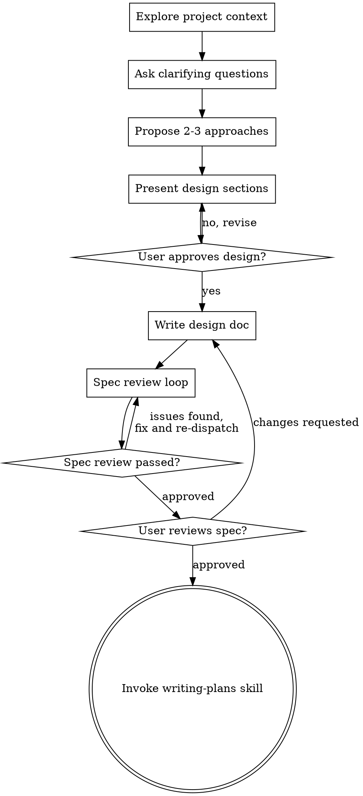

> **Related skills:** Consider `/skill:using-git-worktrees` to set up an isolated workspace, then `/skill:writing-plans` for implementation planning.

# Brainstorming Ideas Into Designs

Help turn ideas into fully formed designs and specs through natural collaborative dialogue.

Start by understanding the current project context, then ask questions one at a time to refine the idea. Once you understand what you're building, present the design and get user approval.

<HARD-GATE>
Do NOT invoke any implementation skill, write any code, scaffold any project, or take any implementation action until you have presented a design and the user has approved it. This applies to every project regardless of perceived simplicity.
</HARD-GATE>

## Anti-Pattern: "This Is Too Simple To Need A Design"

Every project goes through this process. The design can be short for simple work, but you MUST present it and get approval before moving on.

## Boundaries
- Read code and docs: yes
- Write to docs/plans/: yes
- Edit or create any other files: no

## Checklist

You MUST complete these in order:

1. **Explore project context** — check files, docs, recent commits
2. **Ask clarifying questions** — one at a time, understand purpose, constraints, success criteria
3. **Propose 2-3 approaches** — with trade-offs and your recommendation
4. **Present design** — in sections scaled to complexity, get approval as you go
5. **Write design doc** — save to `docs/plans/YYYY-MM-DD-<topic>-design.md` and commit
6. **Spec review loop** — dispatch the spec-document-reviewer prompt, fix issues, re-review until approved (max 5 iterations)
7. **User reviews written spec** — ask the user to approve the written file before planning
8. **Transition to implementation** — invoke `/skill:writing-plans`

## Process Flow

**Before anything else — check git state:**
- Run `git status` and `git log --oneline -5`
- If on a feature branch with uncommitted or unmerged work, ask the user:
  - "You're on `<branch>` with uncommitted changes. Want to finish/merge that first, stash it, or continue here?"
- Require exactly one of: finish prior work, stash, or explicitly continue here
- If the topic is new, suggest creating a new branch before brainstorming

**Understanding the idea:**
- Check out the current project state first (files, docs, recent commits)
- Check if the codebase or ecosystem already solves this before designing from scratch
- Before asking detailed questions, assess scope. If the request describes multiple independent subsystems, decompose it first and only brainstorm the first sub-project in this cycle.
- Ask questions one at a time to refine the idea
- Prefer multiple choice questions when possible, but open-ended is fine too
- Only one question per message - if a topic needs more exploration, break it into multiple questions
- Focus on understanding: purpose, constraints, success criteria

**Exploring approaches:**
- Propose 2-3 different approaches with trade-offs
- Present options conversationally with your recommendation and reasoning
- Lead with your recommended option and explain why

**Presenting the design:**
- Once you believe you understand what you're building, present the design
- Scale each section to its complexity: a few sentences if straightforward, up to 200-300 words if nuanced
- Ask after each section whether it looks right so far
- Cover: architecture, components, data flow, error handling, testing
- Be ready to go back and clarify if something doesn't make sense

**Design for isolation and clarity:**
- Break the system into smaller units with one clear purpose and well-defined interfaces
- Favor boundaries that are easy to understand, test, and change independently
- When a file or component seems likely to become large or tangled, treat that as a design problem, not an implementation detail

**Working in existing codebases:**
- Explore the current structure before proposing changes
- Follow existing patterns unless they directly obstruct the task
- Include targeted improvements where the existing structure is actively in the way, but avoid unrelated refactoring

## After the Design

**Documentation:**
- Write the validated design to `docs/plans/YYYY-MM-DD-<topic>-design.md`
- Commit the design document to git

**Spec Review Loop:**
After writing the spec document:

1. Fill the template at `spec-document-reviewer-prompt.md`
2. Dispatch it with `subagent({ agent: "doc-reviewer", task: "... filled template ..." })`
3. If issues are found: fix the spec, commit the updated spec, re-dispatch, repeat until approved
4. If the loop exceeds 5 iterations, stop and ask the user for guidance

**User Review Gate:**
After the spec review loop passes, ask the user to review the written spec before proceeding:

> "Spec written and committed to `<path>`. Please review it and let me know if you want to make any changes before we start writing the implementation plan."

If the user requests changes, update the spec, commit the updated spec, and re-run the review loop. Only continue once the user approves.

Then mark the brainstorm phase complete: call `plan_tracker` with `{action: "update", status: "complete"}` for the current phase.

**Implementation (if continuing):**
- Ask: "Ready to set up for implementation?"
- Set up isolated workspace — `/skill:using-git-worktrees` for larger work, or just create a branch for small changes
- Use `/skill:writing-plans` to create the detailed implementation plan
- Do NOT invoke any other implementation skill from here

## Key Principles

- **One question at a time** - Don't overwhelm with multiple questions
- **Multiple choice preferred** - Easier to answer than open-ended when possible
- **YAGNI ruthlessly** - Remove unnecessary features from all designs
- **Design for testability** - Favor approaches with clear boundaries that are easy to verify with TDD
- **Explore alternatives** - Always propose 2-3 approaches before settling
- **Incremental validation** - Present design in sections, validate each
- **Be flexible** - Go back and clarify when something doesn't make sense
