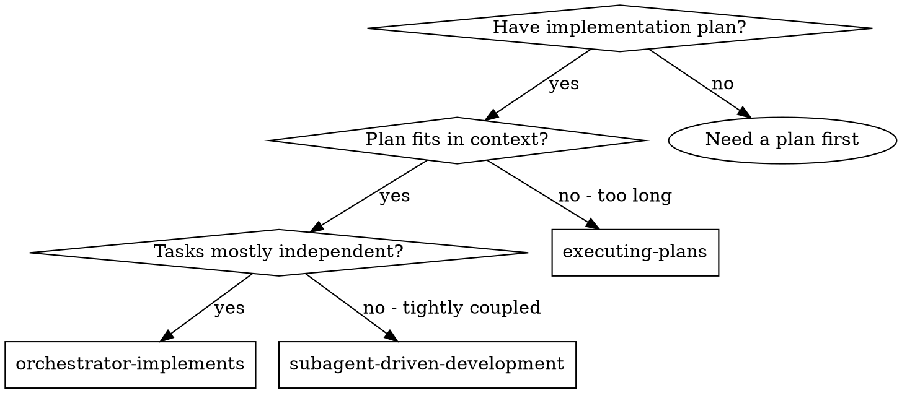
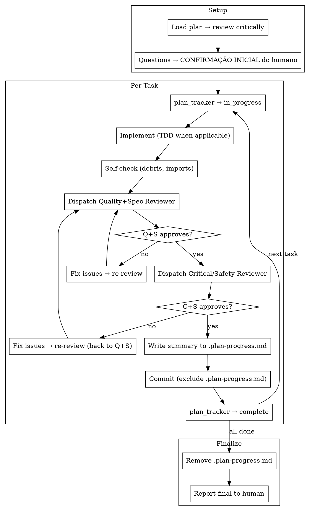

> **Related skills:** Need a plan first? `/skill:writing-plans`. Done? `/skill:finishing-a-development-branch`.
> **Alternative workflows:** Subagents implement? `/skill:subagent-driven-development`. Parallel sessions? `/skill:executing-plans`.

# Orchestrator Implements

The orchestrator (main LLM) implements all tasks directly, dispatching subagent reviewers for quality assurance after each task. Single human interaction before execution begins.

**Core principle:** Orchestrator holds full context + implements directly + cheap reviewer subagents catch blind spots = high quality, economical, autonomous.

## When to Use



**Choose this when:**
- Plan has independent tasks that fit in a single context window
- You want the main LLM to hold the full picture (cross-referencing between tasks)
- You want autonomous execution after initial confirmation
- Economy matters: one strong LLM + cheap reviewers

**Don't choose when:**
- Plan is too long (pollutes context) → use `executing-plans`
- Tasks are tightly coupled (need shared mutable state) → use `subagent-driven-development`
- You want continuous human feedback → use `executing-plans`

## Prerequisites
- Active branch (not main) or user-confirmed intent to work on main
- Approved plan or clear task scope

## The Process



### Step 1: Setup

1. Read plan file
2. Review critically — identify questions or concerns
3. If concerns: ask the human before starting
4. Initialize `plan_tracker` with all tasks

### Step 2: Human Checkpoint (only if needed)

If the plan is complete and clear, **skip straight to execution** — no confirmation needed.

Only pause for human input if:
- The plan has gaps, ambiguities, or contradictions
- You discovered concerns during critical review (Step 1)
- You need clarification on requirements or architecture

**If you do ask questions, get confirmation and then execution is autonomous.** Only stop again for blocking errors (see Step 4).

### Step 3: Execute Tasks

For each task:

#### a. Mark in progress
```
plan_tracker({ action: "update", index: N, status: "in_progress" })
```

#### b. Implement (TDD when applicable)
- New code → full TDD (failing test first, then implement)
- Modifying tested code → run existing tests before and after
- Trivial change → use judgment, run tests after

#### c. Self-check
Quick sweep before dispatching reviewers:
- No `console.log`, `var_dump`, `dd()`, `print()` debug statements
- No unused imports
- No commented-out code
- No leftover `TODO`/`FIXME` from implementation

This is NOT a quality review — it's removing obvious debris to avoid wasting reviewer calls.

#### d. Dispatch Quality+Spec Reviewer

Use the prompt template from `../subagent-driven-development/quality-spec-reviewer-prompt.md`.

**What to fill in:**
- `[FULL TEXT of task requirements]` — the task spec from the plan
- `[From implementer's report]` — your own summary of what you implemented
- `{BASE_SHA}` — the commit SHA before you started this task
- `{HEAD_SHA}` — current HEAD

```ts
subagent({ agent: "spx-quality-spec-reviewer", task: "... filled template ..." })
```

**If reviewer finds issues:** Fix them, then re-dispatch the same reviewer. Repeat until approved.

#### e. Dispatch Critical/Safety Reviewer

Use the prompt template from `../subagent-driven-development/critical-reviewer-prompt.md`.

**What to fill in:**
- `[From implementer's report and git diff]` — summary of what changed
- `{BASE_SHA}` — the commit SHA before you started this task
- `{HEAD_SHA}` — current HEAD

```ts
subagent({ agent: "spx-critical-reviewer", task: "... filled template ..." })
```

**If reviewer finds issues:** Fix them, then go back to Step d (Quality+Spec review again). This ensures fixes are fully reviewed.

#### f. Write summary to .plan-progress.md

Append a compact summary to the progress file (one that won't be committed):

```
## Task N: [name] — DONE
- Files: path/to/file1.ts, path/to/file2.ts
- What: [1-2 lines]
- Decisions: [any non-obvious choices that affect future tasks]
```

This file is your external memory — consult it with `read` when you need to recall what a previous task did, instead of keeping full details in context.

#### g. Commit (exclude .plan-progress.md)

```bash
git add -A
git reset HEAD .plan-progress.md
git commit -m "feat: [description of task]"
```

**Never commit `.plan-progress.md`** — it is a temporary artifact.

#### h. Mark complete
```
plan_tracker({ action: "update", index: N, status: "complete" })
```

### Step 4: Blocking Errors

**STOP execution and report to the human only when:**
- A task fails after **2 fix attempts** in the review loop
- You discover a fundamental problem with the plan that makes remaining tasks unworkable
- You're genuinely stuck and cannot proceed safely

**When you stop:**
- Explain what happened
- Show what's been completed so far
- Propose next steps or ask for guidance

### Step 5: Finalize

After all tasks are complete:

1. **Remove the progress file:**
   ```bash
   rm -f .plan-progress.md
   ```

2. **Report to the human:**
   - Summary of all tasks completed
   - Files changed
   - Test results
   - Any concerns or notes
   - Suggest using `/skill:finishing-a-development-branch` for final integration

## Context Management

Since the orchestrator holds the full conversation, managing context is critical:

**DO:**
- Use `bash` with `grep`, `head`, `wc -l` to probe files instead of reading entire files
- Use `.plan-progress.md` as external memory for completed tasks
- Use `git diff`, `git log --oneline` to recall what was done (it's in git)
- Keep summaries compact — 1-2 lines per task in the progress file

**DON'T:**
- `read` entire files when a `grep` would suffice
- Repeat full file contents when referencing previous work
- Accumulate verbose reviewer output — extract just the verdict and issues

## Model Selection for Reviewers

Reviewers can use cheaper models since they follow structured templates:
- **Quality+Spec Reviewer** — needs to understand the spec and read code, standard model is fine
- **Critical/Safety Reviewer** — needs to trace dependencies and spot risks, standard model is fine

## Red Flags

**Never:**
- Start implementation on main/master branch without explicit user consent
- Skip reviews (Quality+Spec OR Critical/Safety)
- Commit `.plan-progress.md`
- Dispatch both reviewers simultaneously (Quality+Spec must pass first)
- Proceed with unfixed issues from either reviewer
- Stop for non-blocking issues (fix and continue autonomously)
- Skip the self-check before reviewers (wastes reviewer calls on obvious debris)

**Always:**
- Only pause for human input if the plan has issues (otherwise just execute)
- Record task summaries in `.plan-progress.md`
- Clean up `.plan-progress.md` at the end
- Commit after each task
- Go back to Quality+Spec review after fixing Critical/Safety issues (full re-review cycle)

## Integration

**Required workflow skills:**
- **`/skill:writing-plans`** — Creates the plan this skill executes
- **`/skill:finishing-a-development-branch`** — Complete development after all tasks

**Reuses from subagent-driven-development:**
- **`quality-spec-reviewer-prompt.md`** — Quality+Spec review prompt template
- **`critical-reviewer-prompt.md`** — Critical/Safety review prompt template

**Subagents follow by default:**
- **TDD** — as described in implementation step
