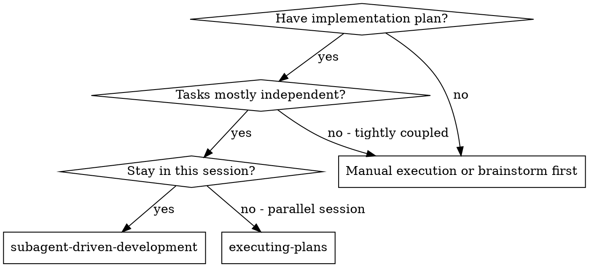
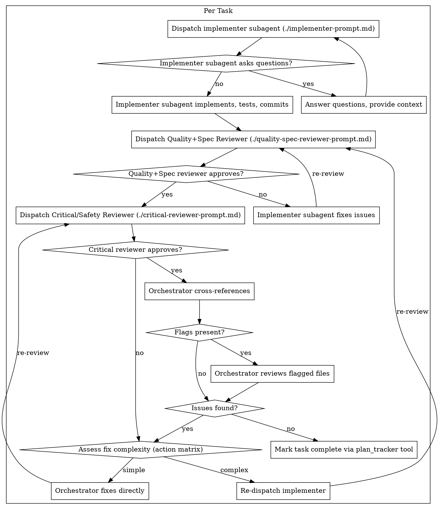

> **Related skills:** Need an isolated workspace? `/skill:using-git-worktrees`. Need a plan first? `/skill:writing-plans`. Done? `/skill:finishing-a-development-branch`.

# Subagent-Driven Development

Execute plan by dispatching fresh subagent per task, with two-stage review after each: Quality+Spec review first, then Critical/Safety review.

**Core principle:** Fresh subagent per task + two-stage review (quality+spec → critical) = high quality, catches blind spots

If a tool result contains a ⚠️ workflow warning, stop immediately and address it before continuing.

## Prerequisites
- Active branch (not main) or user-confirmed intent to work on main
- Approved plan or clear task scope

## When to Use



**vs. Executing Plans (parallel session):**
- Same session (no context switch)
- Fresh subagent per task (no context pollution)
- Two-stage review after each task: Quality+Spec first, then Critical/Safety
- Faster iteration (no human-in-loop between tasks)

**Dependent tasks:** Most real plans have some dependencies. For dependent tasks, include the previous task's implementation summary and relevant file paths in the next subagent's context. Track what each completed task produced so you can pass it forward.

## Model Selection

Choose model capability deliberately:

- **Mechanical implementation tasks** (small, localized, complete spec) → cheaper model is fine
- **Integration or debugging tasks** (multiple files, coordination, pattern matching) → standard model
- **Architecture, planning, or review-heavy tasks** → most capable model available

If an implementer gets stuck for capability reasons, re-dispatch with a more capable model instead of blindly retrying.

## The Process



### Orchestrator Review

After code quality reviewer approves, the orchestrator **always** performs a final review before marking the task complete.

**What the orchestrator reviews:**
1. Read the Review Summary from code-quality-reviewer
2. **Always** cross-reference mentally with:
   - Previous tasks' implementation summaries (what patterns were established)
   - Upcoming tasks in the plan (does this implementation help or hinder them)
   - Global project context (naming conventions, architectural decisions)
3. If **Flags for orchestrator** is not "none", open those specific files for detailed review

**What the orchestrator checks:**
- Consistency with previous tasks (naming, patterns, structure)
- Side effects on completed work
- Readiness for upcoming tasks
- Business context alignment

**Important:** Flags are hints for which files need detailed review, NOT a gate for whether to review. The orchestrator always does the mental cross-reference — this is the core value of this step.

**How the orchestrator acts:**

| Problem type | Action |
|--------------|--------|
| Typos, unused imports, local variable names | Fix directly |
| Rename private functions/methods, adjust error messages | Fix directly |
| Small logic adjustments in isolated functions | Fix directly |
| Add small helper functions | Fix directly |
| Adjust internal (non-public) function signatures | Fix directly |
| Refactor code within a single function | Fix directly |
| Changes to public APIs or shared modules | Re-dispatch implementer |
| Logic changes affecting multiple files | Re-dispatch implementer |
| Architectural concerns | Escalate to user |

**Re-dispatch context:**

When re-dispatching implementer after finding issues, include:
1. The specific flag that triggered the review
2. The orchestrator's analysis of the issue
3. The required fix
4. Relevant file paths

**Loop prevention:**

Orchestrator-initiated re-dispatches are subject to the same "2 attempts" limit as regular failures. After 2 failed fix attempts:
- Minor issue → Log it, mark task complete, note in final report
- Blocking issue → Escalate to user with full context

**Edge case: Missing or malformed Review Summary**

If the code quality reviewer doesn't produce a Review Summary:
1. Re-dispatch reviewer with format reminder
2. If still missing, fall back to `git diff HEAD~1` and proceed with review

Fallback review outcomes follow the same action matrix.

## Prompt Templates

- `./implementer-prompt.md` - Dispatch implementer subagent
- `./quality-spec-reviewer-prompt.md` - Dispatch Quality+Spec reviewer subagent
- `./critical-reviewer-prompt.md` - Dispatch Critical/Safety reviewer subagent

**How to dispatch:**

Use the `subagent` tool directly with the template text filled in:

```ts
subagent({ agent: "implementer", task: "... full implementer prompt text ..." })
```

```ts
subagent({ agent: "quality-spec-reviewer", task: "... full quality+spec review prompt text ..." })
```

```ts
subagent({ agent: "critical-reviewer", task: "... full critical/safety review prompt text ..." })
```

## Handling Implementer Status

Implementer subagents report one of four statuses. Handle them explicitly:

- **`DONE`** — proceed to spec compliance review
- **`DONE_WITH_CONCERNS`** — read the concerns before proceeding; if they affect correctness or scope, address them first
- **`NEEDS_CONTEXT`** — provide the missing context and re-dispatch
- **`BLOCKED`** — change something before retrying: provide more context, use a stronger model, split the task, or escalate to the user

Never ignore an escalation and never force the same retry without changing the conditions.

## Example Workflow

```
You: I'm using Subagent-Driven Development to execute this plan.

[Read plan file once: docs/plans/feature-plan.md]
[Extract all 5 tasks with full text and context]
[Initialize plan_tracker tool with all tasks]

Task 1: Hook installation script

[Get Task 1 text and context (already extracted)]
[Dispatch implementation subagent with full task text + context]

Implementer: "Before I begin - should the hook be installed at user or system level?"

You: "User level (~/.config/superpowers/hooks/)"

Implementer: "Got it. Implementing now..."
[Later] Implementer:
  - Implemented install-hook command
  - Added tests, 5/5 passing
  - Self-review: Found I missed --force flag, added it
  - Committed

[Dispatch spec compliance reviewer]
Spec reviewer: ✅ Spec compliant - all requirements met, nothing extra

[Get git SHAs, dispatch code quality reviewer]
Code reviewer: Strengths: Good test coverage, clean. Issues: None. Approved.

[Orchestrator review]
  - Reads Review Summary
  - Flag present: opens shared config module
  - Checks: change is additive, no breaking changes
  - Cross-reference: next task needs config read, this prepares well
  - No issues found

[Mark Task 1 complete]

Task 2: Recovery modes

[Get Task 2 text and context (already extracted)]
[Dispatch implementation subagent with full task text + context]

Implementer: [No questions, proceeds]
Implementer:
  - Added verify/repair modes
  - 8/8 tests passing
  - Self-review: All good
  - Committed

[Dispatch spec compliance reviewer]
Spec reviewer: ❌ Issues:
  - Missing: Progress reporting (spec says "report every 100 items")
  - Extra: Added --json flag (not requested)

[Implementer fixes issues]
Implementer: Removed --json flag, added progress reporting

[Spec reviewer reviews again]
Spec reviewer: ✅ Spec compliant now

[Dispatch code quality reviewer]
Code reviewer: Strengths: Solid. Issues (Important): Magic number (100)

[Implementer fixes]
Implementer: Extracted PROGRESS_INTERVAL constant

[Code reviewer reviews again]
Code reviewer: ✅ Approved

[Orchestrator review]
  - Reads Review Summary
  - No flags
  - Cross-reference: naming consistent with Task 1
  - No issues found

[Mark Task 2 complete]

...

[After all tasks]
[Dispatch final code-reviewer]
Final reviewer: All requirements met, ready to merge

Done!
```

## Red Flags

**Never:**
- Start implementation on main/master branch without explicit user consent
- Skip reviews (spec compliance OR code quality)
- Proceed with unfixed issues
- Dispatch multiple implementation subagents in parallel (conflicts)
- Make subagent read plan file (provide full text instead)
- Skip scene-setting context (subagent needs to understand where task fits)
- Ignore subagent questions (answer before letting them proceed)
- Accept "close enough" on spec compliance (spec reviewer found issues = not done)
- Skip review loops (reviewer found issues = implementer fixes = review again)
- Let implementer self-review replace actual review (both are needed)
- Skip orchestrator review when flags are present (read the summary, check flagged files)
- **Start code quality review before spec compliance is ✅** (wrong order)
- Move to next task while either review has open issues
- Ignore `DONE_WITH_CONCERNS`, `BLOCKED`, or `NEEDS_CONTEXT`

**If subagent asks questions:**
- Answer clearly and completely
- Provide additional context if needed
- Don't rush them into implementation

**If reviewer finds issues:**
- Implementer (same subagent) fixes them
- Reviewer reviews again
- Repeat until approved
- Don't skip the re-review

**If subagent fails task:**
- See **"When a Subagent Fails"** below — never code directly, always re-dispatch or escalate

## When a Subagent Fails

**You are the orchestrator. You do NOT write code. You dispatch subagents that write code.**

If an implementer subagent fails, errors out, or returns `BLOCKED` / `NEEDS_CONTEXT` / incomplete work:

1. **Attempt 1:** Dispatch a NEW fix subagent with specific instructions about what went wrong and what needs to change. Include the error output and the original task text.
2. **Attempt 2:** If the fix subagent also fails, dispatch one more with a different approach or simplified scope.
3. **After 2 failed attempts: Split the task and continue.**
   - Analyze the failing task and divide it into 2-3 smaller, more manageable parts
   - Consider: natural granularity (functions, modules, layers), complexity isolation, logical dependencies, and size reduction
   - If the task is already too simple to split, skip to step 5
4. **Update the plan:**
   - Reconstruct the task list: completed tasks + new subtasks + remaining tasks
   - Call `plan_tracker({ action: "init", tasks: [reconstructed-list] })`
   - Mark completed tasks: `plan_tracker({ action: "update", index: N, status: "complete" })` for each
   - Continue execution with the first new subtask
5. **If a subtask also fails 2x: STOP.** Report to the user. Maximum 1 level of task division.

## After All Tasks Complete

When all tasks are done and reviewed, **stop and report to the user**:

1. Summarize what was implemented (tasks completed, files changed, test counts)
2. Ask: "All tasks complete. Ready for final review and finishing?"
3. **Wait for user confirmation before proceeding**

Do NOT automatically dispatch final review or start the finishing skill. The user may want to test manually, adjust scope, or take a break before the final phase.

## Integration

**Required workflow skills:**
- **`/skill:using-git-worktrees`** - Recommended: Set up isolated workspace before starting. For small changes, branching in the current directory is acceptable with human approval.
- **`/skill:writing-plans`** - Creates the plan this skill executes
- **`/skill:requesting-code-review`** - Code review template for reviewer subagents
- **`/skill:finishing-a-development-branch`** - Complete development after all tasks

**Subagents follow by default:**
- **TDD** - Runtime warnings on source-before-test patterns. Implementer subagents receive three-scenario TDD instructions via agent profile and prompt template: new feature (full TDD), modifying tested code (run existing tests), trivial change (judgment call).

**Alternative workflow:**
- **`/skill:executing-plans`** - Use for parallel session instead of same-session execution
